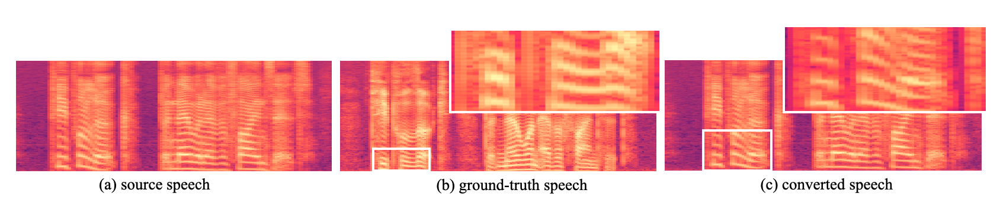

# MAIN-VC

## Abstract

One-shot voice conversion aims to change the timbre of any source speech to match that of the unseen target speaker with only one speech sample. Existing methods face difficulty in satisfactory speech representation disentanglement and suffer from sizable networks. We propose a method to effectively disentangle with a concise neural network. Our model learns clean speech representations via siamese encoders with the enhancement of the designed mutual information estimator. The siamese structure and the newly designed convolution module contribute to the lightweight of our model while ensuring the performance in diverse voice conversion tasks.

## Overview

Figure.1 The Architecture of MAIN-VC

&nbsp;
 

## Audio Samples in VC Tasks
Audio samples are taken from the VCTK dataset and AISHELL dataset.

<table>
	<CAPTION>Table.1 Traditional Voice Conversion (seen speakers)</CAPTION>
    <tr>
        <th>  </th>
	<th> Source </th>
        <th> Target </th>
        <th> Baseline </th>
	<th> MAIN-VC </th>
    </tr>
<tr>
        <th> F2F </th>
	<th> <audio controls id="player" onplay="pauseOthers(this);"><source src="assets/s2s_raw/p228_154.mp3" type="audio/mpeg"></audio> </th>
        <th> <audio controls id="player" onplay="pauseOthers(this);"><source src="assets/s2s_raw/p233_025.mp3" type="audio/mpeg"></audio> </th>
        <th> <audio controls id="player" onplay="pauseOthers(this);"><source src="assets/ADAINVC/s2s/p228_154_p233_025.mp3" type="audio/mpeg"></audio> </th>
        <th> <audio controls id="player" onplay="pauseOthers(this);"><source src="assets/MAINVC/s2s/F2Fp228_154_p233_025.mp3" type="audio/mpeg"></audio> </th>
</tr>
	
<tr>
        <th> M2M </th>
	<th> <audio controls id="player" onplay="pauseOthers(this);"><source src="assets/s2s_raw/p374_070.mp3" type="audio/mpeg"></audio> </th>
        <th> <audio controls id="player" onplay="pauseOthers(this);"><source src="assets/s2s_raw/p286_028.mp3" type="audio/mpeg"></audio> </th>
        <th> <audio controls id="player" onplay="pauseOthers(this);"><source src="assets/ADAINVC/s2s/p374_070_p286_028.mp3" type="audio/mpeg"></audio> </th>
        <th> <audio controls id="player" onplay="pauseOthers(this);"><source src="assets/MAINVC/s2s/M2Mp374_070_p286_028.mp3" type="audio/mpeg"></audio> </th>
</tr>

<tr>
        <th> F2M </th>
	<th> <audio controls id="player" onplay="pauseOthers(this);"><source src="assets/s2s_raw/p313_300.mp3" type="audio/mpeg"></audio> </th>
        <th> <audio controls id="player" onplay="pauseOthers(this);"><source src="assets/s2s_raw/p363_041.mp3" type="audio/mpeg"></audio> </th>
        <th> <audio controls id="player" onplay="pauseOthers(this);"><source src="assets/ADAINVC/s2s/p313_300_p363_041.mp3" type="audio/mpeg"></audio> </th>
        <th> <audio controls id="player" onplay="pauseOthers(this);"><source src="assets/MAINVC/s2s/F2Mp313_300_p363_041.mp3" type="audio/mpeg"></audio> </th>
</tr>
    
<tr>
        <th> M2F </th>
	<th> <audio controls id="player" onplay="pauseOthers(this);"><source src="assets/s2s_raw/p270_234.mp3" type="audio/mpeg"></audio> </th>
        <th> <audio controls id="player" onplay="pauseOthers(this);"><source src="assets/s2s_raw/p265_148.mp3" type="audio/mpeg"></audio> </th>
        <th> <audio controls id="player" onplay="pauseOthers(this);"><source src="assets/ADAINVC/s2s/p270_234_p265_148.mp3" type="audio/mpeg"></audio> </th>
        <th> <audio controls id="player" onplay="pauseOthers(this);"><source src="assets/MAINVC/s2s/M2Fp270_234_p265_148.mp3" type="audio/mpeg"></audio> </th>
</tr>	
</table>

&nbsp;
 

<table>
	<CAPTION>Table.2 One-shot Voice Conversion (unseen speakers)</CAPTION>
    <tr>
        <th>  </th>
	<th> Source </th>
        <th> Target </th>
        <th> Baseline </th>
	<th> MAIN-VC </th>
    </tr>
<tr>
        <th> F2F </th>
	<th> <audio controls id="player" onplay="pauseOthers(this);"><source src="assets/u2u_raw/p225_001.mp3" type="audio/mpeg"></audio> </th>
        <th> <audio controls id="player" onplay="pauseOthers(this);"><source src="assets/u2u_raw/p268_004.mp3" type="audio/mpeg"></audio> </th>
        <th> <audio controls id="player" onplay="pauseOthers(this);"><source src="assets/ADAINVC/u2u/p225_001_p268_004.mp3" type="audio/mpeg"></audio> </th>
        <th> <audio controls id="player" onplay="pauseOthers(this);"><source src="assets/MAINVC/u2u/F2Fp225_001_p268_004.mp3" type="audio/mpeg"></audio> </th>
</tr>
	
<tr>
        <th> M2M </th>
	<th> <audio controls id="player" onplay="pauseOthers(this);"><source src="assets/u2u_raw/p345_112.mp3" type="audio/mpeg"></audio> </th>
        <th> <audio controls id="player" onplay="pauseOthers(this);"><source src="assets/u2u_raw/p360_012.mp3" type="audio/mpeg"></audio> </th>
        <th> <audio controls id="player" onplay="pauseOthers(this);"><source src="assets/ADAINVC/u2u/p345_112_p360_012.mp3" type="audio/mpeg"></audio> </th>
        <th> <audio controls id="player" onplay="pauseOthers(this);"><source src="assets/MAINVC/u2u/M2Mp345_112_p360_012.mp3" type="audio/mpeg"></audio> </th>
</tr>

<tr>
        <th> F2M </th>
	<th> <audio controls id="player" onplay="pauseOthers(this);"><source src="assets/u2u_raw/p225_001.mp3" type="audio/mpeg"></audio> </th>
        <th> <audio controls id="player" onplay="pauseOthers(this);"><source src="assets/u2u_raw/p360_010.mp3" type="audio/mpeg"></audio> </th>
        <th> <audio controls id="player" onplay="pauseOthers(this);"><source src="assets/ADAINVC/u2u/p225_001_p360_010.mp3" type="audio/mpeg"></audio> </th>
        <th> <audio controls id="player" onplay="pauseOthers(this);"><source src="assets/MAINVC/u2u/F2Mp225_001_p360_010.mp3" type="audio/mpeg"></audio> </th>
</tr>
    
<tr>
        <th> M2F </th>
	<th> <audio controls id="player" onplay="pauseOthers(this);"><source src="assets/u2u_raw/p345_058.mp3" type="audio/mpeg"></audio> </th>
        <th> <audio controls id="player" onplay="pauseOthers(this);"><source src="assets/u2u_raw/p268_062.mp3" type="audio/mpeg"></audio> </th>
        <th> <audio controls id="player" onplay="pauseOthers(this);"><source src="assets/ADAINVC/u2u/p345_058_p268_062.mp3" type="audio/mpeg"></audio> </th>
        <th> <audio controls id="player" onplay="pauseOthers(this);"><source src="assets/MAINVC/u2u/M2Fp345_058_p268_062.mp3" type="audio/mpeg"></audio> </th>
</tr>
</table>

&nbsp;
 

<table>
	<CAPTION>Table.3 Cross-lingual One-shot Voice Conversion (Mandarin-to-English, unseen speakers)</CAPTION>
    <tr>
	<th> </th>
	<th> Source </th>
        <th> Target </th>
	<th> MAIN-VC </th>
    </tr>
<tr>
	<th> M2E F2M </th>
	<th> <audio controls id="player" onplay="pauseOthers(this);"><source src="assets/xlang_raw/IC0001W0001.mp3" type="audio/mpeg"></audio> </th>
        <th> <audio controls id="player" onplay="pauseOthers(this);"><source src="assets/xlang_raw/p247_001.mp3" type="audio/mpeg"></audio> </th>
        <th> <audio controls id="player" onplay="pauseOthers(this);"><source src="assets/MAINVC/xlang/IC0001W0001_p247_001.mp3" type="audio/mpeg"></audio> </th>
</tr>
	
<tr>
	<th> M2E M2F </th>
	<th> <audio controls id="player" onplay="pauseOthers(this);"><source src="assets/xlang_raw/IC0010W0010.mp3" type="audio/mpeg"></audio> </th>
        <th> <audio controls id="player" onplay="pauseOthers(this);"><source src="assets/xlang_raw/p244_001.mp3" type="audio/mpeg"></audio> </th>
        <th> <audio controls id="player" onplay="pauseOthers(this);"><source src="assets/MAINVC/xlang/IC0010W0010_p244_001.mp3" type="audio/mpeg"></audio> </th>
</tr>
    
<tr>
	<th> M2E F2M </th>
	<th> <audio controls id="player" onplay="pauseOthers(this);"><source src="assets/xlang_raw/IC0001W0001.mp3" type="audio/mpeg"></audio> </th>
        <th> <audio controls id="player" onplay="pauseOthers(this);"><source src="assets/xlang_raw/p316_001.mp3" type="audio/mpeg"></audio> </th>
        <th> <audio controls id="player" onplay="pauseOthers(this);"><source src="assets/MAINVC/xlang/IC0001W0001_p316_001.mp3" type="audio/mpeg"></audio> </th>
</tr>

<tr>
	<th> M2E M2M </th>
	<th> <audio controls id="player" onplay="pauseOthers(this);"><source src="assets/xlang_raw/IC0002W0002.mp3" type="audio/mpeg"></audio> </th>
        <th> <audio controls id="player" onplay="pauseOthers(this);"><source src="assets/xlang_raw/p360_001.mp3" type="audio/mpeg"></audio> </th>
        <th> <audio controls id="player" onplay="pauseOthers(this);"><source src="assets/MAINVC/xlang/IC0002W0002_p360_001.mp3" type="audio/mpeg"></audio> </th>
</tr>
</table>

&nbsp;
 

## Mel-Spectrogram Samples in One-shot VC

Figure.2 VC task "<i>The rainbow is a division of white light into many beautiful colors.</i>"

Figure.3 VC task "<i>People look, but no one finds it.</i>"

Figure.4 VC task "<i>Some have accepted it as a miracle without physical explanation.</i>"

&nbsp;
 

## Ablation Study
Compare  __MAIN-VC__ with: 
+ _w/o CMI_: the proposed method __without__ CMI module,
+ _w/o SE_: the proposed method __without__ siamese encoder.

<table>
	<CAPTION>Table.3 Ablation Study</CAPTION>
<tr>
	<th> Source </th>
        <th> Target </th>
	<th> w/o CMI </th>
	<th> w/o SE </th>
	<th> MAIN-VC </th>
</tr>
<tr>
	<th> <audio controls id="player" onplay="pauseOthers(this);"><source src="assets/u2u_raw/p225_001.mp3" type="audio/mpeg"></audio> </th>
        <th> <audio controls id="player" onplay="pauseOthers(this);"><source src="assets/u2u_raw/p268_004.mp3" type="audio/mpeg"></audio> </th>
        <th> <audio controls id="player" onplay="pauseOthers(this);"><source src="assets/ab1/p225_001_p268_004.mp3" type="audio/mpeg"></audio> </th>
	<th> <audio controls id="player" onplay="pauseOthers(this);"><source src="assets/ab2/p225_001_p268_004.mp3" type="audio/mpeg"></audio> </th>
	<th> <audio controls id="player" onplay="pauseOthers(this);"><source src="assets/MAINVC/u2u/F2Fp225_001_p268_004.mp3" type="audio/mpeg"></audio> </th>
</tr>
	
<tr>
	<th> <audio controls id="player" onplay="pauseOthers(this);"><source src="assets/u2u_raw/p225_001.mp3" type="audio/mpeg"></audio> </th>
        <th> <audio controls id="player" onplay="pauseOthers(this);"><source src="assets/u2u_raw/p360_010.mp3" type="audio/mpeg"></audio> </th>
        <th> <audio controls id="player" onplay="pauseOthers(this);"><source src="assets/ab1/p225_001_p360_010.mp3" type="audio/mpeg"></audio> </th>
	<th> <audio controls id="player" onplay="pauseOthers(this);"><source src="assets/ab2/p225_001_p360_010.mp3" type="audio/mpeg"></audio> </th>
	<th> <audio controls id="player" onplay="pauseOthers(this);"><source src="assets/MAINVC/u2u/F2Mp225_001_p360_010.mp3" type="audio/mpeg"></audio> </th>
</tr>

<tr>
	<th> <audio controls id="player" onplay="pauseOthers(this);"><source src="assets/u2u_raw/p345_112.mp3" type="audio/mpeg"></audio> </th>
        <th> <audio controls id="player" onplay="pauseOthers(this);"><source src="assets/u2u_raw/p360_012.mp3" type="audio/mpeg"></audio> </th>
        <th> <audio controls id="player" onplay="pauseOthers(this);"><source src="assets/ab1/p345_112_p360_012.mp3" type="audio/mpeg"></audio> </th>
	<th> <audio controls id="player" onplay="pauseOthers(this);"><source src="assets/ab2/p345_112_p360_012.mp3" type="audio/mpeg"></audio> </th>
	<th> <audio controls id="player" onplay="pauseOthers(this);"><source src="assets/MAINVC/u2u/M2Mp345_112_p360_012.mp3" type="audio/mpeg"></audio> </th>
</tr>
    
<tr>
	<th> <audio controls id="player" onplay="pauseOthers(this);"><source src="assets/u2u_raw/p345_058.mp3" type="audio/mpeg"></audio> </th>
        <th> <audio controls id="player" onplay="pauseOthers(this);"><source src="assets/u2u_raw/p268_062.mp3" type="audio/mpeg"></audio> </th>
        <th> <audio controls id="player" onplay="pauseOthers(this);"><source src="assets/ab1/p345_058_p268_062.mp3" type="audio/mpeg"></audio> </th>
	<th> <audio controls id="player" onplay="pauseOthers(this);"><source src="assets/ab2/p345_058_p268_062.mp3" type="audio/mpeg"></audio> </th>
	<th> <audio controls id="player" onplay="pauseOthers(this);"><source src="assets/MAINVC/u2u/M2Fp345_058_p268_062.mp3" type="audio/mpeg"></audio> </th>
</tr>	
</table>

&nbsp;
 

